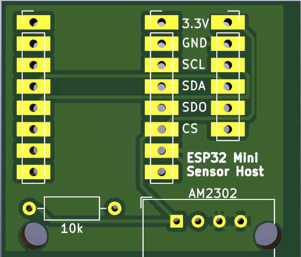
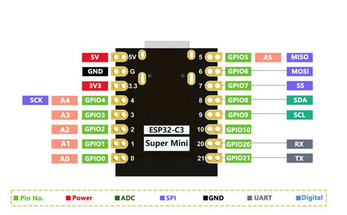

# NOTES
ESP32-C3 Super Mini - with support for AM2302 or BME680 sensors  

For monitoring humidity, pressure, tempurature, gas* (VOX)

**BME only*

## ESP32Home Config
[yaml](esp32home.yaml)

## Rendering

## ESP32-C3 Super Mini Pin Mappings

## Errata
Fucked up ic2 config - pinout is swapped wrong  

|Function|GPIO Pin|
|----|---|
|sda| "GPIO9"|
|scl| "GPIO8"|

### TO FIX
* USB to be off the edge of the board
* pinout to be fixed
* add pin labels for esp32 pins
* pretty sure i got the esp32 footprint up the wrong way
* esp32 footprint - to convert to single side no drill.